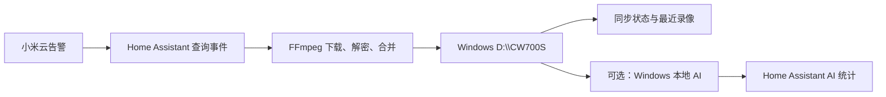

# 小米 CW700S 告警录像自动归档与本地 AI 分类

从一台 Windows 11 电脑开始，按核心路径操作约 60–90 分钟，你将手动触发第一条小米 CW700S 云告警录像，并把它下载到 `D:\CW700S`。之后可以按需加入定时同步、Home Assistant 仪表板、健康监控和本地 AI 分类。

> 本项目只用于管理本人拥有并有权访问的摄像头和录像。

## 先选路线

### 核心路径：先下载第一条 MP4

按顺序完成下面三章：

1. [00. 在 VMware 中安装 Home Assistant OS](docs/00-install-haos-vmware.md)
2. [01. 连接 CW700S、Windows 存储与教程仓库](docs/01-environment.md)
3. [02. 安装下载器并取得第一条 MP4](docs/02-install-downloader.md)

完成标志：Windows 的 `D:\CW700S\PeopleMotion` 或 `D:\CW700S\ObjectMotion` 中出现 MP4，Home Assistant 中出现 `sensor.cw700s_sync_status`。

### 可选增强

- [03. 自动同步与仪表板](docs/03-automation-and-dashboard.md)
- [04. 系统健康监控](docs/04-health-monitoring.md)
- [05. Windows 本地 AI 分类](docs/05-local-ai.md)

这些章节不影响核心下载流程。先确认第一条 MP4，再决定是否继续。

### 出现问题

直接查 [06. 排错与回滚](docs/06-troubleshooting.md)，无需从头重读。

## 你会搭建什么

同一台 Windows 电脑承担三个角色：

- **Windows 宿主机**：运行 VMware Workstation Pro；
- **录像存储**：通过 SMB 共享 `D:\CW700S`；
- **AI 主机**：可选使用 NVIDIA GPU 或 CPU 分析已归档录像。

Home Assistant OS 运行在 VMware 虚拟机中，负责查询小米云、调用 FFmpeg、定时同步和展示状态。

## 已验证环境

最后核对日期：2026-07-29。

| 项目 | 已验证版本 | 验证状态 |
|---|---|---|
| Windows | Windows 11 专业版 `10.0.26200` | 实际运行 |
| VMware Workstation Pro | `17.6.0 build-24238078` | 实际运行 |
| Home Assistant OS | `18.1` | 实际运行 |
| Home Assistant Core | `2026.7.4` | 实际运行 |
| Xiaomi Miot | `1.1.4` | 实际下载过 MP4 |
| HACS | 采用当前官方 HAOS 安装流程 | 文档核对，未在本环境回归 |
| Python | `3.12.10` | 实际运行 AI |
| PyTorch | `2.13.0+cu130` | 实际运行 AI |
| OpenCV | `5.0.0` | 实际运行 AI |
| Ultralytics | `8.4.109` | 实际运行 AI |
| GPU | RTX 3050 Laptop GPU，驱动 `610.62` | 实际运行 AI |

版本更新后，优先按各项目官方文档核对界面和安装命令。表格只说明这组版本已经验证，不表示其他版本一定不兼容。

## 适用范围

- 摄像机：小米室外摄像机 CW700S；
- 已验证 MIoT 型号：`isa.camera.hlzoom`；
- Xiaomi 集成：第三方 [Xiaomi Miot](https://github.com/al-one/hass-xiaomi-miot)，不是 Home Assistant 内置的 Xiaomi Miio；
- Home Assistant：Home Assistant OS；
- Windows 归档根目录：`D:\CW700S`；
- Home Assistant 网络存储名：`Windows_CW700S`；
- 默认挂载路径：`/media/Windows_CW700S`。

其他小米摄像机可能使用不同的云事件、录像格式或加密方式，本项目不承诺兼容。项目不实现实时直播；实时画面请使用 Xiaomi Home（米家）。

## 固定值与需要替换的值

| 值 | 怎么处理 |
|---|---|
| `camera.your_cw700s` | 必须替换为自己的 CW700S 摄像头实体 |
| `Windows_CW700S` | 初学者路径保持不变 |
| `/media/Windows_CW700S` | 初学者路径保持不变 |
| `D:\CW700S` | 初学者路径保持不变 |

首次 `full_scan: true` 默认查询最近 35 天；日常增量同步查询最近 30 天。它们不是不限时间的全量历史。

## 已实现功能

- 增量扫描小米云告警事件；
- 按文件 ID 去重，失败后重试，并从状态文件继续同步；
- 使用 AES-128 与 FFmpeg 下载、解密并合并录像；
- 通过 SMB 将录像保存到 Windows；
- 在 Home Assistant 中预览最近六条录像；
- 监控共享目录、剩余空间、最近同步时间和失败事件；
- 可选在 Windows 本地识别人、车和动物。

## 仓库目录

| 目录 | 用途 |
|---|---|
| `custom_components/` | 安装到 Home Assistant 的 CW700S 下载器 |
| `home-assistant/` | 脚本、packages、仪表板卡片和前端资源 |
| `windows-ai/` | 可选的 Windows 本地 AI 分类器 |
| `docs/` | 核心路径、增强功能和排错说明 |
| `assets/` | 通过隐私检查后才可发布的教程素材 |

## 安全边界

- 不提交账号、密码、设备 ID、token、Cookie、IP 地址或签名 URL；
- 不提交录像、缩略图、数据库、日志、模型权重或运行状态文件；
- 小米云临时签名地址不得放进文档、Issue 或聊天记录；
- AI 预览图包含真实摄像头画面，发布前必须遮盖人员、住址和邻居信息。

## 致谢与许可证

本项目使用或对接 [Home Assistant](https://www.home-assistant.io/)、[Xiaomi Miot](https://github.com/al-one/hass-xiaomi-miot)、[FFmpeg](https://ffmpeg.org/)、[Ultralytics](https://docs.ultralytics.com/)、[OpenCV](https://opencv.org/) 和 [PyTorch](https://pytorch.org/)，与这些项目及其维护者不存在隶属或官方合作关系。

本项目以 [MIT License](LICENSE) 发布。
