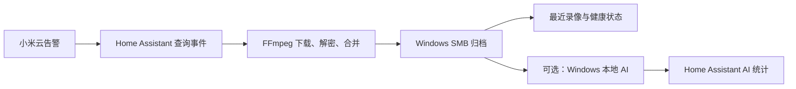

# 小米 CW700S 告警录像自动归档与本地 AI 分类

把小米云告警录像自动下载到 Windows，通过 Home Assistant 查看同步状态和最近录像，并可选使用本地 GPU 识别人、车和动物。

> 本项目仅用于管理本人拥有并有权访问的摄像头和录像。

## 已实现功能

- 增量扫描小米云告警事件；
- 按文件 ID 去重，失败后重试，并从已保存的状态继续同步；
- 使用 AES-128 与 FFmpeg 下载、解密并合并录像；
- 通过 SMB 将录像保存到 Windows；
- 在 Home Assistant 中预览最近六条录像；
- 监控共享目录、剩余空间、最近同步时间和失败事件；
- 可选在 Windows 本地执行人物、车辆和动物分类。

## 适用环境与限制

- 已测试摄像头：小米室外摄像机 CW700S；
- 已测试 MIoT 型号：`isa.camera.hlzoom`；
- Home Assistant OS，并已安装 [Xiaomi Miot](https://github.com/al-one/hass-xiaomi-miot)；
- Windows SMB 默认挂载为 `/media/Windows_CW700S`；
- 本地 AI 已在 Windows + NVIDIA RTX 3050 上测试，也可使用 CPU 模式；
- 其他小米摄像机可能使用不同的事件、录像格式或加密方式，本项目不承诺兼容；
- 未实现实时直播。实时画面请使用 Xiaomi Home（米家）查看。

## 数据流

## 初学者路径使用固定目录

按本教程安装时，只替换摄像头实体，目录和网络存储名称保持不变：

| 值 | 要求 |
|---|---|
| `camera.your_cw700s` | 替换为 Home Assistant 中自己的 CW700S 摄像头实体 |
| `Windows_CW700S` | Home Assistant 网络存储必须使用这个名称，挂载路径才是代码固定使用的 `/media/Windows_CW700S` |
| `D:\CW700S` | Windows 归档根目录保持为这个路径 |

首次 `full_scan: true` 使用 `INITIAL_DAYS = 35`，只扫描最近 35 天，并非不限时间的全量历史；日常增量同步使用 `INCREMENTAL_DAYS = 30`。需要调整时，在复制组件前编辑 `custom_components/cw700s_downloader/__init__.py` 中的这两个常量。

高级用法可以更换 SMB 挂载路径，但必须在安装前同时修改以下位置，不能只改教程命令：

- 集成 `custom_components/cw700s_downloader/__init__.py` 中的 `DESTINATION_ROOT`；
- 健康脚本 `home-assistant/scripts/cw700s_health.py` 中的 `ROOT`；
- AI 状态脚本 `home-assistant/scripts/cw700s_ai_status.py` 中的 `DB_PATH`；
- 教程中所有包含 `/media/Windows_CW700S` 的复制、检查和回滚命令。

不要把账号、`did`、token、Cookie、签名 URL、IP 地址、用户名或密码写进仓库。

## 快速开始

按顺序完成前两章即可手动同步第一条录像；其余章节按需继续。

1. [01. 环境准备](docs/01-environment.md)
2. [02. 安装录像下载器](docs/02-install-downloader.md)
3. [03. 自动同步与仪表板](docs/03-automation-and-dashboard.md)
4. [04. 系统健康监控](docs/04-health-monitoring.md)
5. [05. Windows 本地 AI 分类（可选）](docs/05-local-ai.md)
6. [06. 排错与隐私检查](docs/06-troubleshooting.md)

## 仓库目录

| 目录 | 用途 |
|---|---|
| `custom_components/` | 安装到 Home Assistant 的 CW700S 下载器组件 |
| `home-assistant/` | 复制到 `/config` 的脚本、packages、仪表板卡片和前端资源 |
| `windows-ai/` | 可选的 Windows 本地 AI 分类器及启动脚本 |
| `docs/` | 按安装顺序编写的完整教程与排错说明 |
| `assets/` | 经过隐私检查后才可发布的教程素材 |

## 安全边界

- 只处理本人拥有并获准访问的设备和录像；
- 不提交录像、缩略图、数据库、日志、模型权重或运行状态文件；
- 小米云返回的临时签名地址不得分享，也不得写入文档、Issue 或日志片段；
- 本地 AI 是可选步骤，不影响录像下载主流程。

## 致谢

本项目使用或对接 [Home Assistant](https://www.home-assistant.io/)、[Xiaomi Miot](https://github.com/al-one/hass-xiaomi-miot)、[FFmpeg](https://ffmpeg.org/)、[Ultralytics](https://docs.ultralytics.com/)、[OpenCV](https://opencv.org/) 和 [PyTorch](https://pytorch.org/)。本项目与这些项目及其维护者不存在隶属或官方合作关系。

## 许可证

本项目以 [MIT License](LICENSE) 发布。
